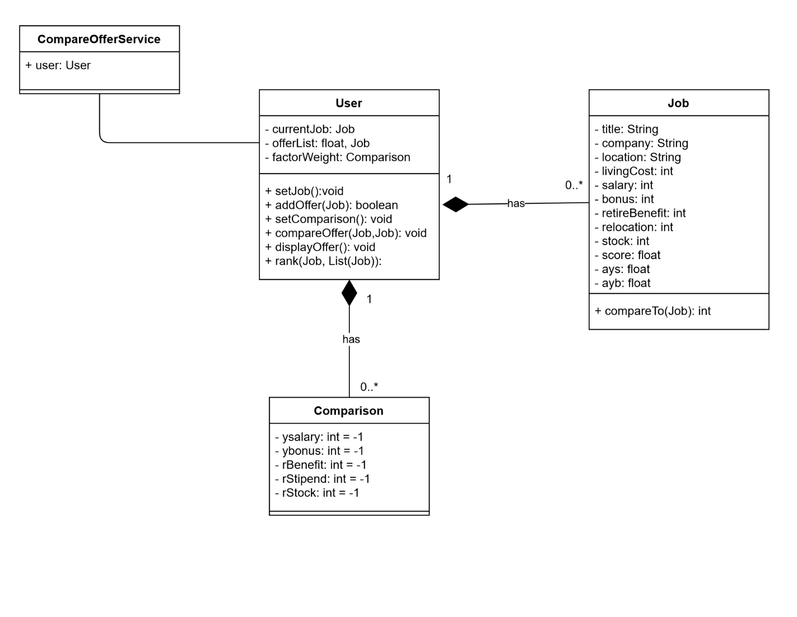

# Discussion on individual designs

## Design1 (Kun Wang)

Pros
- The author considers the requirements carefully and makes sure all requirements are met. All necessary classes, attributes and operations are identified.
- It covers all conditions from requirement.
- It provides very detailed information about how modules interact.

Cons
- The diagram is too complex to understand. The GUI communication part is not necessary in the UML design. To make the diagram more readable, the basic operations (e.g. set() and get() may be omitted).
- The use of lines that represent relationships is complex and not used carefully to show the actual design idea.
- No description for relationships may cause ambiguity of how they work exactly.

## Design 2(Hao-Jen Wang)

Pros
- All attributes and operations are labeled by the right access. The usage of words on the relationships makes the diagram more easily understood.
- A clear entry point can be seen in the design. User actions are well encapsulated into different classes, which show a good understanding of object-oriented design.
- The type of input argument and return type are clearly identified which helps reader to understand quickly.

Cons
- The relationship between entry and its child class is not reasonable.
- Weight can be grouped into a separate class.
- The class design is mostly based on GUI which does not really fit UML requirement.

## Design 3(Xiaoran Zhang)

Pros
- The UML diagram meets all requirements perfectly. Simple and straightforward named attributes and operations make the diagram more readable. The relationship between the classes sufficiently addresses the requirement.
- Nouns in the requirements are clearly extracted and encapsulated into different classes. The service model addresses the design of this project.
- The diagram is user-oriented and can be easily extended if a user requires more functionality.

Cons
- ays and ayb are calculated by other attributes of the class job. It is better to set sys/ayb operations instead of attributes.
- `CompareOfferService` class can have more methods to show what kind of service it can provide.\
- The operation `compareTo` in the `Job` class is somewhat redundant since the operation `compareOffer` exists in the `User` class.

## Design 4(Xinying Jia)

Pros
- Relationship between `Compare` and `Job` class are uniquely shown as multiple `Job` objects can be compared by `Compare` class.
- The enumeration class is a simple but effective to show the job is a current job or offer.
- The diagram is job-oriented and can be easily extended if more job operations or functionalities are required.

Cons
- Class `JobStatus` can have details like data type of current job and offer.
- Class `User` should include attribute with data type Job, otherwise it cannot explain the relationship between `User` class and `Job` class.
- The meaning of self-loop relationship in `Job` class is not very clear. It might be helpful to add more description for the relationship.

# Team Design

After discussing, we all agree to choose the UML of Xiaoran Zhang as the base. Then we work together and fix some minor mistakes. Such as spelling mistakes.This final team design meets all requirements perfectly. The diagram design is very reasonable. Variable names and function names are simple and straightforward which makes the diagram easy to understand. The usage of words on the association lines indicates how the classes relate to each other.

The main difference among all the individual designs lies in whether GUI components should be represented as a class shown in UML class diagram or shouldn’t be added in it. We aligned our understanding on GUI and decided that service model should be chosen to address the application requirements. The service model uses a service class which is responsible for drawing GUI and transition between screens. `CompareOfferService` class wraps the activity provided by the service. Therefore, it is easier to understand the whole class diagram without bothering by the GUI components. And, the service has a `User` member to represent the single user who is using the current app. Data input to the application is saved into the `User` member. We have observed that `User` and `Job` classes exist in almost all the individual designs. Therefore, it is natual to incorporate these classes into our final design. Since the weights can be grouped together, a `Weight` class can be seen in some of the individual designs and it is kept in the final design.

# Summary

We faced a large discrepancy about GUI components at the beginning of our discussion. After clarifying the definition of GUI components and deciding on what model to be used for the project, we found it is not necessary to include GUI components in the UML class diagram and they should be wrapped in a service class. Discussion on the details of GUI and the class diagram leads us to decide a final design unanimously. Once a final design is available, the document writing tasks are distributed without a hitch. We believe that the rest of the group project can be completed through the same discussion as this one.