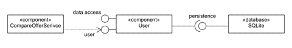
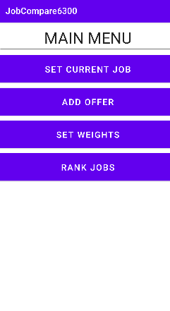
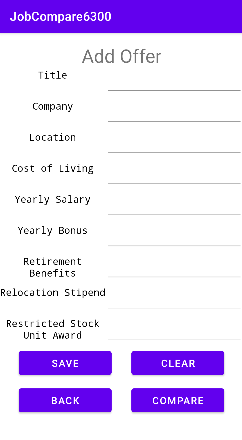
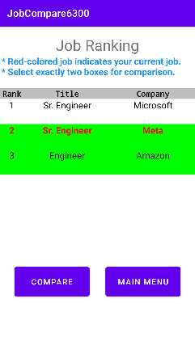

# Design Document

**Author**: Hao-Jen Wang, Kun Wang

## 1 Design Considerations

### 1.1 Assumptions

- The application is implemented by UI components which is responsive to user inputs.
- Each UI component can return to the main menu except the main menu itself.
- All information is stored in the local database. The current system does not support remote data backup or retrieval.
- Since login/logout functions are not required, they are ignored in this design document and the use case model.
- Software dependencies: Android SDK, including SQLite for database

### 1.2 Constraints

- One service is only servable for one user.
- The application should be run on Android mobile devices.
- The maximum length of offer list should be fixed depending on the remaining memory size. If a user requests to add more jobs and causes memory crash, the oldest jobs should be swapped out.

### 1.3 System Environment

- Environment: Mobile application
- Operating Systems: Android
- Platform: Android SDK
- Hardware: Android emulator or Android phone whose version should be newer or equal to 10.0 (Q)

## 2 Architectural Design

### 2.1 Component Diagram

There are three nodes in our design. First is the component of `CompareOfferService` who is responsible for managing GUI transition and using `User` component to show information on the screen. `User` is another component in the app, which stores job data and ranks jobs according to weights. The final node is the database to persistent `User` data between app sessions.

### 2.2 Deployment Diagram

The app is supposed to be running on an Android device and therefore it is developed utilizing Android SDK. In order to persist data between different app sessions, Android SQLite is used.

## 3 Low-Level Design

### 3.1 Class Diagram

## 4 User Interface Design

The table below shows the prototypes of UI components:

| Main Menu | Set Current Job form  | Add Offer form |
|:-:|:-:|:-:|
|  |  |  |

| Set Weight form | Rank Jobs form  | Compare Jobs form |
|:-:|:-:|:-:|
|  |  |  |
