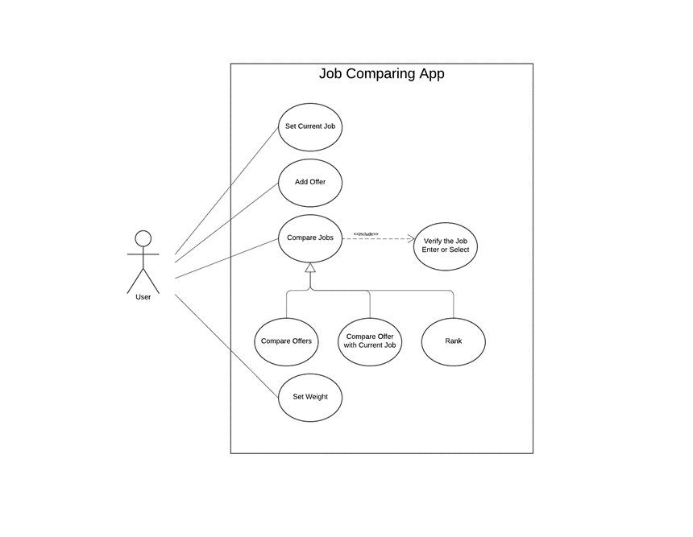

# Use Case Model 

**Author**: Xinying Jia

## 1 Use Case Diagram 

## 2 Use Case Descriptions 
  
Use case: Set Current Job 
- *Requirements: User create a new job as the current job*
- *Pre-conditions: Conditions that must be true before the use case is run.*
- *Post-conditions: Job class details are saved and showed.*
- *Scenarios: If the current does not exist, user create a new current job and save it. If the current job exists, users update the current job.*

Use case: Add Offer
- *Requirements: User create a new job class and add it to the offer list*
- *Pre-conditions: Conditions that must be true before the use case is run.*
- *Post-conditions: Offer details are saved and showed*
- *Scenarios: none* 

Use case: Compare Jobs
- *Requirements: The selected jobs are compared under the selected compare weight*
- *Pre-conditions: Two or more jobs are created and selected*
- *Post-conditions: The selected jobs are calculated and sorted then showed details in sorted order.*
- *Scenarios:*  
  1. User select target at least two jobs (current job or offer)
  2. Each target job calculated under the compare weight setting (if not set, then use the default setting.)
  3. Sort the target jobs by the compare score.
  4. display the job details on the sorted order.

Use case: Set Weights
- *Requirements: Use set a new comparing weight*
- *Pre-conditions: none*
- *Post-conditions: The weight settings are updated*
- *Scenarios: none*